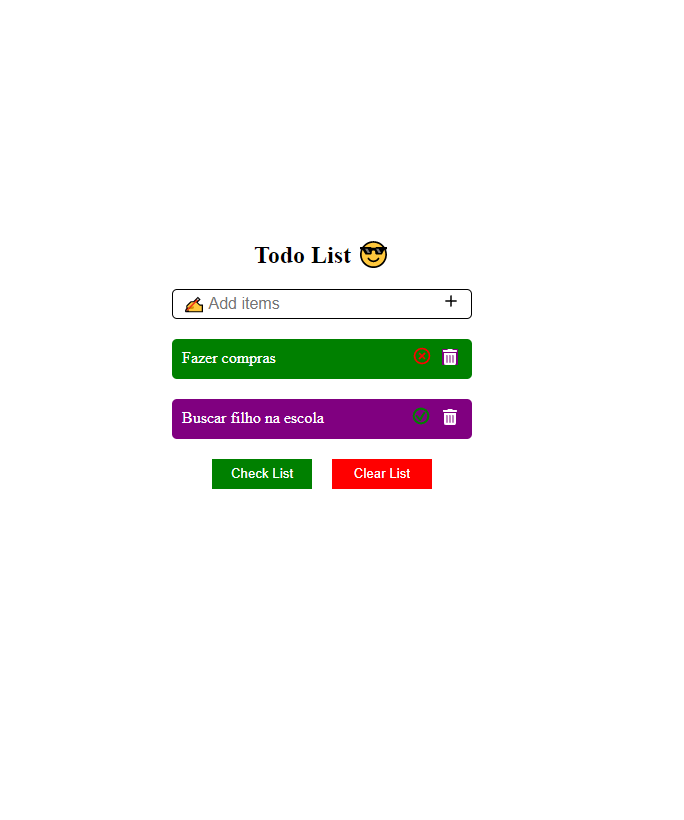
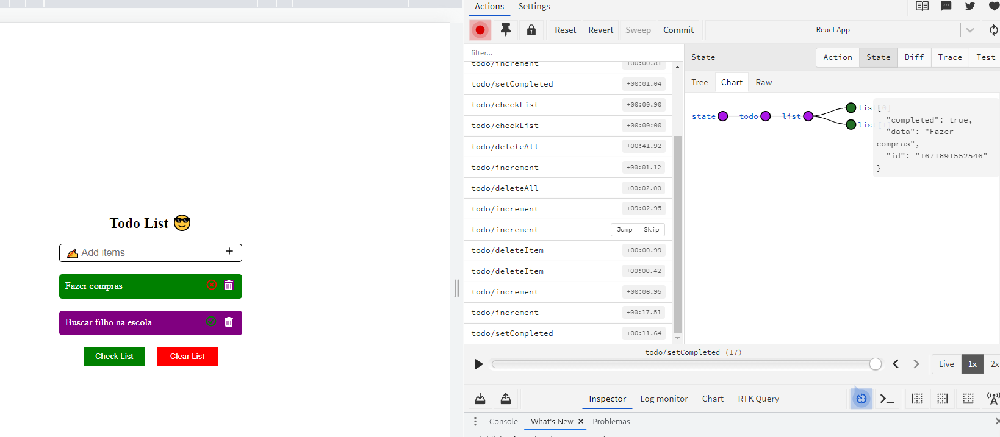

# Todo List Redux Toolkit

Esse projeto foi criado com o intuito de realizar um CRUD com Redux em uma aplicação.

O Projeto é simples, trata-se de uma lista que você pode adicionar itens nela, podendo exclui-los ou colocar como concluídos. Após você concluir diversas tarefas basta clicar em Check List que ele vai deletar todos os itens concluídos. Caso queira fazer uma limpeza da lista basta clicar Clear List.

# Improvements

-   `Redux toolkit`: Com esse projeto aprendi a como gerenciar o estado global da aplicação, o que são actions, reducers, como gerencio meu store e como fazer dispatch.

.
.

# 🌐 Go to the Website !!

[Go to WebSite - Click Me !](https://todo-list-redux-3ofwhc92i-gustavotp443.vercel.app/)
